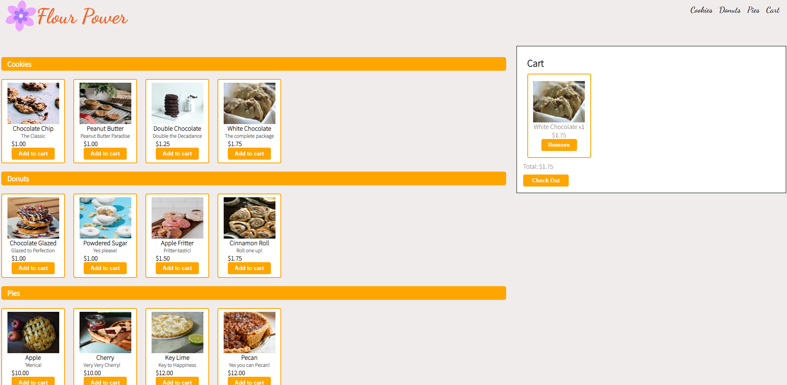

# Bakery-POS

Bakery-POS is a point-of-sale website for the bakery "Flour Power"

## Screenshot

## Task

Create a React application that allows the user to build a village by placing improvements and consuming resources.

## Functionality

Bakery-POS utilizes HTML, CSS and DOM manipulation to dynamically add different bakery items to a cart, gives a total, allows the user to check out, and gives the user a receipt of the items purchased along with the subtotal, tax, and total amount.

## Group Members
Developed by [Kate Grutter](https://github.com/KateGrutter), [Bailey Cytacki-Lewis](https://github.com/baileycytackilewis), [Brandon Soucie](https://github.com/TheAbbott23), and [Franc Rakipi](https://github.com/Francr99)

## Technology

&nbsp;
  &nbsp;
  &nbsp;
